|  | Algorithm and Data Structure |
|--|--|
| NIM |  244107020210|
| Nama |  Khoirul Umam Novalidi |
| Kelas | TI - 1H |
| Repository | [link] (https://github.com/novalrnv/PRAKALSD.git) |

# Labs #1 Programming Fundamentals Review

## 2.1. Pemilihan

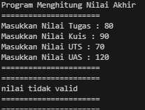
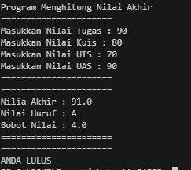

**Penjelesan singkat:** 
Disini ada 6 step utama: 
1.  **Input Nilai Tugas, Kuis, UTS, dan UAS**
2.  **Validasi Nilai (0 - 100)**
3.  **Hitung Nilai Akhir**
4.  **Tentukan Nilai Huruf dan Bobot Nilai**
5.  **Tentukan Status Kelulusan**
6.  **Output Nilai Akhir, Nilai Huruf, Bobot Nilai, dan Status Kelulusan**

## 2.2. Perulangan

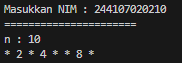

**Penjelesan singkat:** 
Disini ada 5 step utama: 
1.  **Input NIM**
2.  **Hitung `n = NIM % 100`**
3.  **Jika `n > 10`, tambahkan `n` dengan 10**
4.  **Output `n`**
5.  **Perulangan dari `i = 1` hingga `i <= n`**
    -   Jika `i == 6` atau `i == 10`, lanjut ke iterasi berikutnya (`continue`)
    -   Jika `i` **ganjil**, cetak `*`
    -   Jika `i` **genap**, cetak nilai `i`

## 2.3. Array

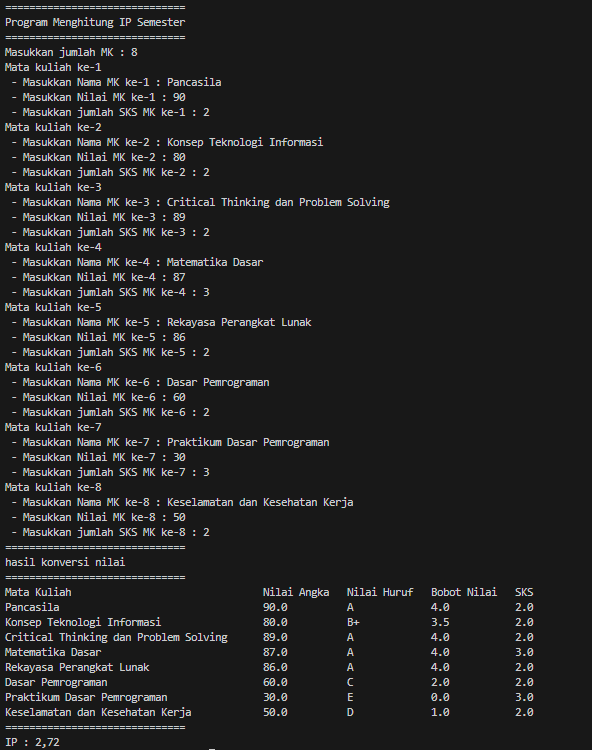

**Penjelesan singkat:** 
Disini ada 7 step utama: 
1.  **Input Jumlah Mata Kuliah**
2.  **Input Nama MK, Nilai Angka, dan SKS**
3.  **Konversi Nilai Angka ke Nilai Huruf dan Bobot Nilai**
4.  **Hitung Total Nilai dan Total SKS**
5.  **Hitung IP Semester**
6.  **Format IP hingga 2 angka di belakang koma**
7.  **Output Hasil Konversi Nilai dan IP Semester**

## 2.4. Fungsi

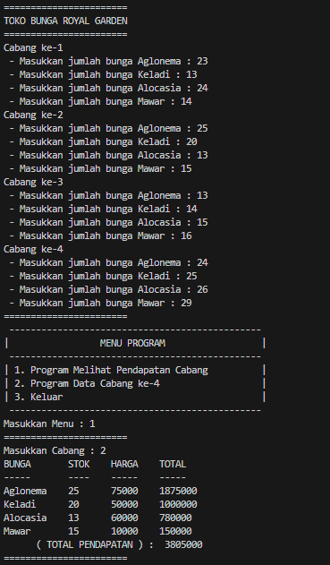
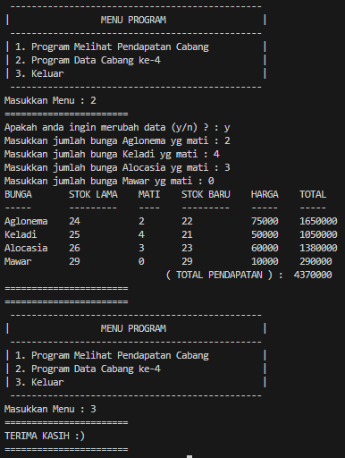

**Penjelesan singkat:** 
Disini ada 6 step utama: 
1.  **Input Jumlah Bunga untuk Setiap Cabang**
2.  **Tampilkan Menu Pilihan**:
    -   **1. Melihat Pendapatan Cabang**
    -   **2. Data Cabang ke-4**
    -   **3. Keluar**
3.  **Jika Pilihan 1**:
    -   Input Nomor Cabang
    -   **Tampilkan Pendapatan Cabang**
4.  **Jika Pilihan 2**:
    -   Pilih untuk Merubah Data (y/n)
    -   Jika **y**: Input Jumlah Bunga yang Mati
    -   **Hitung Stok Baru dan Pendapatan Cabang ke-4**
5.  **Jika Pilihan 3**:
    -   **Keluar dari Program**
6.  **Tampilkan Hasil Sesuai Pilihan**

## Tugas 1

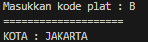
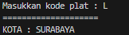

**Penjelesan singkat:** 
Disini ada 4 step utama: 
1.  **Input Kode Plat**
2.  **Konversi Huruf ke Uppercase**
3.  **Cari Index Kode Plat**
4.  **Tampilkan Nama Kota Sesuai Index**

## Tugas 2

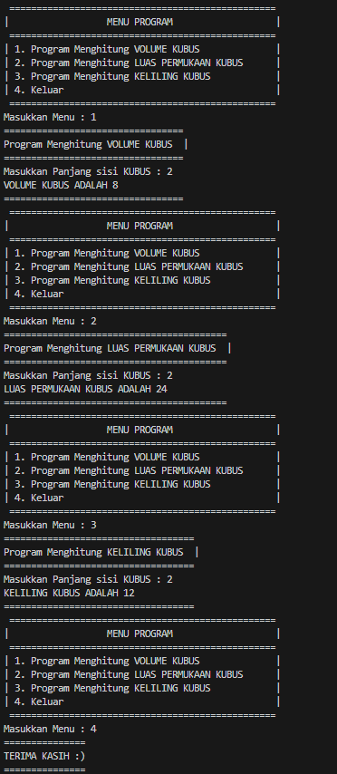

**Penjelesan singkat:** 
Disini ada 5 step utama: 
1.  **Tampilkan Menu**
2.  **Pilih Menu**
3.  **Input Panjang Sisi Kubus**
4.  **Hitung dan Tampilkan Hasil Sesuai Pilihan:**
    -   Volume Kubus
    -   Luas Permukaan Kubus
    -   Keliling Kubus
5.  **Ulangi atau Keluar**
## Tugas 3

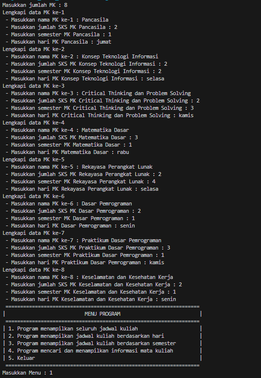
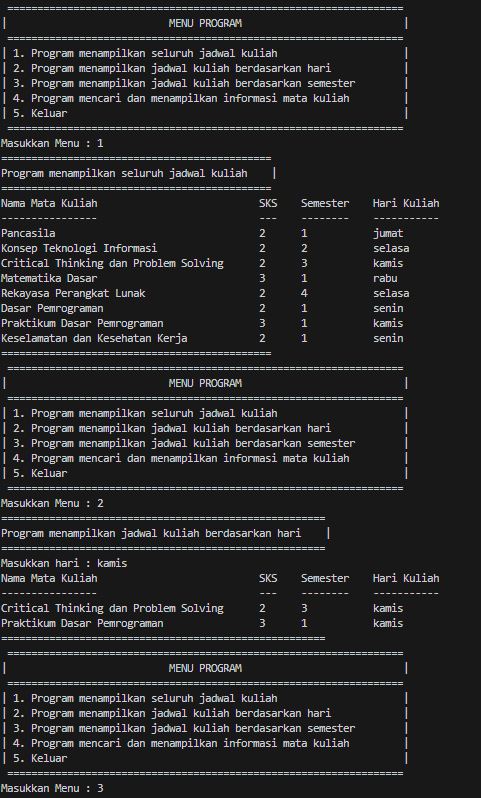
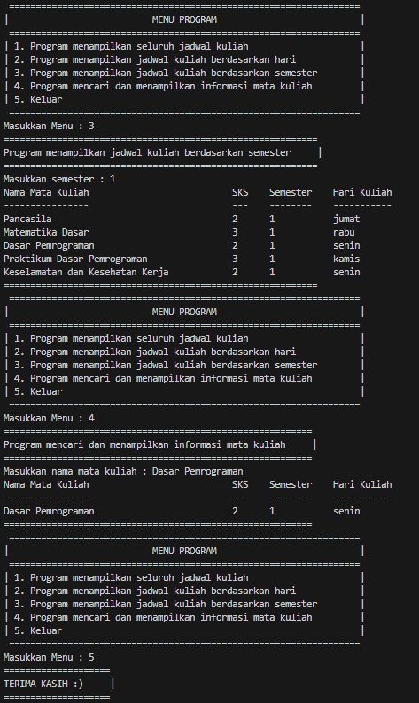

**Penjelesan singkat:** 
Disini ada 4 step utama: 
1.  **Input Data Mata Kuliah:**
    -   Nama MK
    -   Jumlah SKS
    -   Semester
    -   Hari Kuliah
2.  **Tampilkan Menu Program:**
    
    -   Seluruh Jadwal Kuliah
    -   Jadwal Berdasarkan Hari
    -   Jadwal Berdasarkan Semester
    -   Informasi Mata Kuliah
    -   Keluar Program
3.  **Pilih Menu:**
    
    -   **Menu 1:** Tampilkan semua jadwal kuliah.
    -   **Menu 2:** Tampilkan jadwal berdasarkan hari.
    -   **Menu 3:** Tampilkan jadwal berdasarkan semester.
    -   **Menu 4:** Cari dan tampilkan informasi mata kuliah.
    -   **Menu 5:** Keluar dari program.
4.  **Ulangi atau Keluar Program**

## Terima Kasih :)