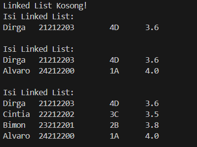
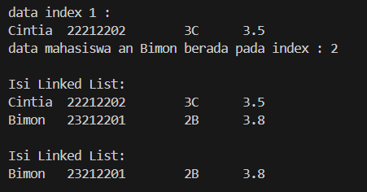

|  | Algorithm and Data Structure |
|--|--|
| NIM |  244107020210 |
| Nama |  KHOIRUL UMAM NOVALIDI |
| Kelas | TI - 1H |
| Repository | [link](https://github.com/novalrnv/PRAKALSD.git) |

#Linked Lis

## 8.1 Pembuatan Single Linked List

### 8.1.1 Percobaan 1

**Penjelasan :**

Terdapat 4 file yaitu : 

- [Mahasiswa12.java](sc_code/Mahasiswa12.java)
- [NodeMahasiswa12.java](sc_code/NodeMahasiswa12.java)
- [SingleLinkedList12.java](sc_code/SingleLinkedList12.java)
- [SLLMain12java](sc_code/SLLMain12.java)

**Verifikasi Hasil**



**Pertanyaan :**

1. Karena pada saat method `print()` dipanggil pertama kali belum ada data yang diinputkan, Oleh karena itu outputnya "Linked List Kosong".

2. variable `temp` digunakan sebagai penunjuk atau pointer sementara untuk memproses data yang diinputkan dalam linkedlist.

3. Menambahkan kode program seperti berikut:
```java
Scanner sc = new Scanner(System.in);
System.out.print("Masukkan NIM : ");
String nim = sc.nextLine();
System.out.print("Masukkan Nama : ");
String nama = sc.nextLine();
System.out.print("Masukkan Kelas : ");
String kelas = sc.nextLine();
System.out.print("Masukkan IPK : ");
double ipk = sc.nextDouble();
sc.nextLine();

Mahasiswa mhsBaru = new Mahasiswa(nim, nama, kelas, ipk);
```

### 8.2.1 Percobaan 2

**Penjelasan :**

Pada percobaan ke 2 ini hanya menambahkan beberapa method.

**Verifikasi Hasil**



**Pertanyaan :**

1. Fungsi `break` di method `remove()` digunakan untuk memberhentikan perulangan setelah data yang ingin dihapus ditemukan.

2. - `temp.next = temp.next.next;` digunakan untuk menghapus data yang berada next dari data yang ingin dihapus.
    - `if (temp.next == null) { trail = temp; }` melakukan mengecekan lalu mengubah nilai `temp` menjadi `trail` jika data yang ingin dihapus adalah data terakhir.

### 8.3.1 Tugas

