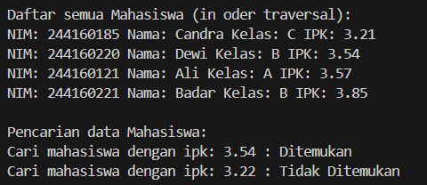
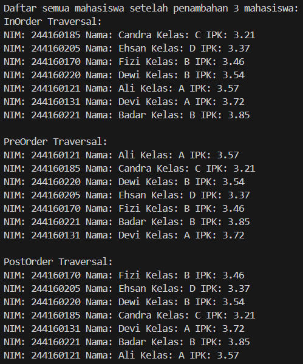
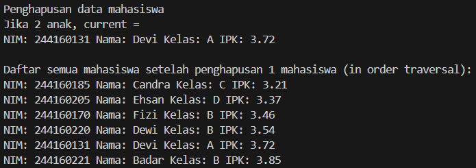
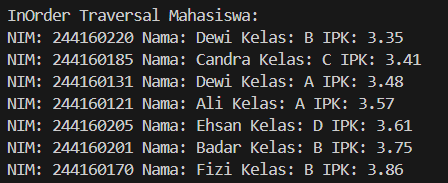

|  | Algorithm and Data Structure |
|--|--|
| NIM |  244107020210|
| Nama |    KHOIRUL UMAM NOVALIDI |
| Kelas | TI - 1H |
| Repository | [link] (https://github.com/Calon-raja-ngoding/PADSD.git) |

# 13.1 Tree

## 13.2.1 Percobaan 1

**Penjelasan :**

Membuat 4 class yaitu :

 - [Mahasiswa12.java](sc_code/Mahasiswa12.java)
 - [Node12.java](sc_code/Node12.java)
 - [BinaryTree12.java](sc_code/BinaryTree12.java)
 - [BinaryTreeMain12.java](sc_code/BinaryTreeMain12.java)

**Verifikasi Hasil**

## 13.2.2 Pertanyaan :

1. Karena pada Binary search tree (BST), setiap node memiliki nilai yang lebih besar dari kiri dan nilai yang lebih kecil dari kanan. Hal ini membuat proses pencarian dapat memotong separuh pohon setiap langkahnya.

2. Atribut `left` digunakan untuk menunjuk nilai yang lebih kecil dan `right` untuk menunjuk nilai yang lebih besar dari suatu Node.

3.  A. `root` adalah node awal atau akar dari pohon, sebagai titik masuk utama untuk memproses traversal, pencarian, penambahan, dan penghapusan.
    
    B. Nilai dari `root` adalah *null* karena tree masih kosong.

4. **Node** yang baru langsung menjadi root dari pohon karena belum ada **node** lain.

5. Baris tersebut digunakan untuk menentukan kemana node baru ditempatkan. Jika nilai lebih kecil, dia akan bergeser ke kiri, dan jika nilai lebih besar, dia akan bergeser ke kanan. Pergeseran tersebut terus berjalan hingga current menjadi null, yang menandakan bahwa ada tempat kosong.

6. Alur langkah-langkah pada method `delete()` ialah :

    - Mencar node yang mau dihapus (`current`).
    - Jika punya dua anak, mencari *Successor* yaitu node dari tree kanan.
    - Memanggil method `getSuccessor()` untuk mengambil node pengganti (`successor`).
    - Menggantikan nilai `current` menjadi `successor` lalu menghapus node `successor` dari posisi aslinya.

    method `getSuccessor()` untuk membantu memastikan agar struktur **(BST)** tetap terjaga seletah node dihapus.

## 13.2.3 Percobaan 2

**Penjelasan :**

Disini saya membuat 2 class baru, yaitu :

- [BinaryTreeArray12.java](sc_code/BinaryTreeArray12.java)
- [BinaryTreeArrayMain12.java](sc_code/BinaryTreeArrayMain12.java)

**Verifikasi Hasil :**

## 13.2.4 Pertanyaan

1. - `data` kegunaan atribut berikut adalah untuk menyimpan nilai node dari tree.
    - `idxLast` digunakan untuk menandakan index terakhir dari array yang digunakan untuk menyimpan nilai node dari tree.

2. Method `populateData()` digunakan untuk menyimpan data ke array tree yang sudah diinisialisasi didalam class `BinaryTreeArray12`.

3. Method `traverseInOrder()` kegunaan method berikut adalah men traversal secara rekursif dari kiri ke kanan.

4. Posisi left child = 5 dan right child = 6.

5. Statement `int idxLast = 6` menandakan bahwa index terakhir dari array.

6. Indeks `2*idxStart+1` dan `2*idxStart+2` digunakan untuk menandakan posisi dari child left dan right dari node, Pemanggilan rekursif mengikutinya sehingga memungkinkan kita menavigasi struktur pohon biner dalam array.

## 13.3 Tugas

