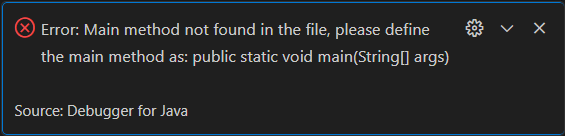
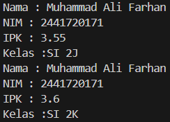

| | Algorithm and Data Structure |
  
|--|--|

| NIM | 244107020210|

| Nama | Khoirul Umam Novalidi |

| Kelas | TI - 1H |

| Repository | [link] (https://github.com/novalrnv/PRAKALSD.git) |
  

# Jobsheet 2 - Object
  

## 2.1 Percobaan 1


### 2.1.1 Langkah-langkah Percobaan


Menginputkan kode program sesuai perintah pada [Mahasiswa12.java](./sc_code/Mahasiswa12.java)


### 2.1.2 Verifikasi




### 2.1.3 Pertanyaan :
1. Karakteristik Class : Memiliki Atribut dan Method

  

	Karakteristik Object : Memiliki Identitas dan Method
  

2. Atribut yang dimiliki oleh class Mahasiswa ada 4, yaitu : Nama, NIM, Kelas, dan IPK.

  

3. Methodnya ada 4, yaitu : 
	- Menampilkan Informasi
	- Mengubah Kelas
	- Menguodate IPK
	- Cek Nilai Kinerja

  

4. Menambahkan Syntax
```java
if (ipkbaru <= 0 || ipkbaru >= 4.0) {
        System.out.println("IPK tidak valid. Harus antara 0.0 dan 4.0");
    }
```

5. Kerja pada method NIlaiKinerja adalah mengevaluasi nilai kinerja Mahasiswa sesuai nilai ipk yang diperoleh dengan menggunakan beberapa kondisi untuk menentukan kinerja setiap Mahasiswa. 
Nilai yang direturnkan adalah beberapa kategori yang diperoleh dari kondisi-kondisi yang terpenuhi.

  

## 2.2 Percobaan 2

### 2.2.1 Langkah-langkah 

Menginputkan Kode Program sesuai perintah pada file [MahasiswaMain12.java](./sc_code/MahasiswaMain12.java)

### 2.2.2 Verifikasi Hasil



### 2.2.3 Pertanyaan :

1. Baris untuk intansiasi pada class MahasiswaMain, yaitu :
```java
Mahasiswa12 mhs1 = new Mahasiswa12();
``` 
Object yang dihasilkan adalah bernama mhs1

2. Untuk mengakses atribut dan method pada suatu object dengan menambahkan operator "." stelah menyebut nama object yang dimaksud.

3. Hasil output dari method tampilkaninformasi() berbeda, karena penempatan ketika pemanggilan method tersebut berbeda.  Penempatan yang pertama terdapat pada baris setleah inisiasi, sedangkan yang kedua ditempatkan setelah menginisiasi method ubahkelas() dan updateipk().
 
