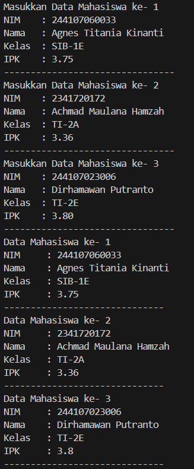
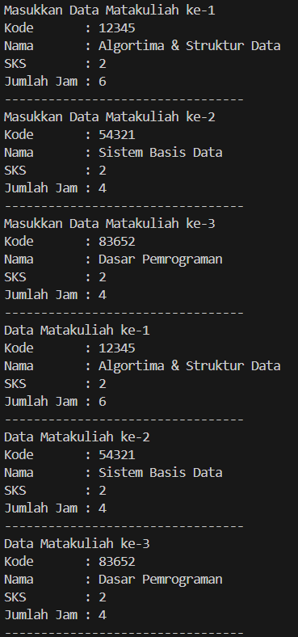
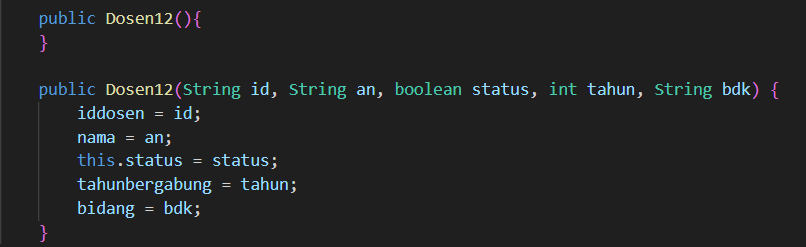
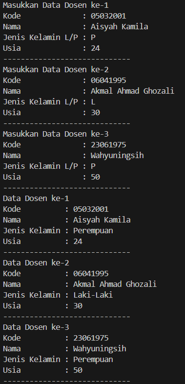
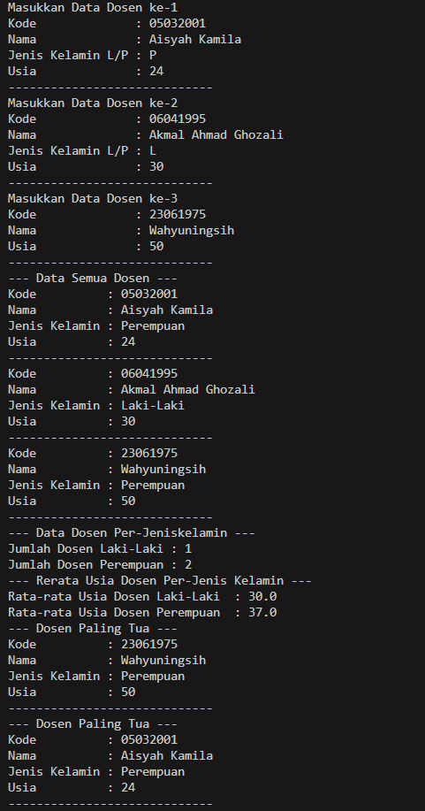

|  | Algorithm and Data Structure |
|--|--|
| NIM |  244107020210|
| Nama |  Khoirul Umam Novalidi |
| Kelas | TI - 1H |
| Repository | [link] (https://github.com/novalrnv/PRAKALSD.git) |
  

# Jobsheet 3 - Array Of Object
  

## 3.1 Percobaan 1 - Membuat Array dari Object, Mengisi dan Menampilkan


### 3.1.1 Langkah-langkah Percobaan


Menginputkan Kode Program sesuai perintah pada file [Mahasiswa12.java](./sc_code/Mahasiswa12.java) dan [MahasiswaDemo12.java](./sc_code/MahasiswaDemo12.java).


### 3.1.2 Verifikasi Hasil Running


### 3.1.3 Pertanyaan : 

1. Tidak harus selalu meliliki, Karena atribut dan method dalam array of object diperlukan sesuai kebutuhan.

2. Kode program tersebut melakukan intansiasi array of object.

3. Tidak memiliki, Pemanggilan tersebut bisa dilakukan karena jika sebuah class tidak memiliki konstruktor apapun maka java akan menyediakan konstruktor default secara otomatis.

4. Menginisiasi array sesuai indeks yang dituju.

5. Class Mahasiswa digunakan untuk memberikan atribut/method pada object, sedangkan class MahasiswaDemo digunakan untuk memanggil class dan method yang terdapat pada class Mahasiswa.


## 3.2 Percobaan 2 - Menerima Input Isian Array Menggunakan Looping


### 3.2.1 Langkah-langkah Percobaan

Menginputkan Kode Program sesuai perintah pada class [Mahasiswa12.java](./sc_code/Mahasiswa12.java) dan [MahasiswaDemo12.java](./sc_code/MahasiswaDemo12.java).


### 3.2.2 Verifikasi Hasil Running




### 3.2.3 Pertanyaan :

1. Menambahkan method baru pada class [Mahasiswa12.java](./sc_code/Mahasiswa12.java) dan memodifikasi kode pada class [MahasiswaDemo12.java](./sc_code/MahasiswaDemo12.java).

2. Kode tersebut error dikarenakan mencoba mengakses object yang belum dibuat.


## 3.3 Percobaan 3 - Constructor Berparameter


### 3.3.1 Langkah-langkah Percobaan

Menginputkan kode sesuai perintah pada class [Matakuliah12.java](./sc_code/Matakuliah12.java) dan class [MatakuliahDemo12.java](./sc_code/MatakuliahDemo12.java).


### 3.3.2 Verifikasi Hasil Running




### 3.3.3 Pertanyaan :

1. Iya dapat memiliki lebih lebih dari 1 constructor, contohnya :



2. Menambahkan method cetakinfo() pada class Matakuliah12.java dan memanggil method tersebut pada class MatakuliahDemo12.java 
```java
public void tambahdata() {
        Scanner sc = new Scanner(System.in);
        System.out.print("Kode       : ");
        kode = sc.nextLine();
        System.out.print("Nama       : ");
        nama = sc.nextLine();
        System.out.print("SKS        : ");
        sks = sc.nextInt();
        System.out.print("Jumlah Jam : ");
        jumlahjam = sc.nextInt();
        System.out.println("---------------------------------");
    }
``` 
```java
for (int i = 0; i < 3; i++){
            System.out.println("Masukkan Data Matakuliah ke-"+ (i + 1));
            arrayOfMatakuliah[i].tambahdata();
    }
```

3. Menambahkan method cetakinfo() pada class Matakuliah12.java dan memanggil method tersebut pada class MatakuliahDemo12.java
```java
public void cetakinfo() {
        System.out.println("Kode       : "+ kode);
        System.out.println("Nama       : "+ nama);
        System.out.println("SKS        : "+ sks);
        System.out.println("Jumlah Jam : "+ jumlahjam);
        System.out.println("---------------------------------");
    }
```
```java
for (int i = 0; i < 3; i++) {
            System.out.println("Data Matakuliah ke-"+ (i + 1));
            arrayOfMatakuliah[i].cetakinfo();
        }
```

4. Memodifikasi kode program
```java
System.out.print("Masukkan Jumlah Matakuliah : ");
        int lengthmatkul = sc.nextInt();
        Matakuliah12[] arrayOfMatakuliah = new Matakuliah12[lengthmatkul];
```


## 3.4 Tugas

### Tugas 1



### Penjelesan Singkat

**1.Deklarasi Variabel dalam Kelas ```Dosen12```**
Kelas ```Dosen12``` dirancang untuk menyimpan informasi mengenai dosen dengan atribut berikut:

- ```kode``` (String) → Berfungsi untuk menyimpan kode unik dosen.
- ```nama``` (String) → Menyimpan nama lengkap dosen.
- ```jeniskelamin``` (Boolean) → Bernilai ```true``` jika laki-laki, dan ```false``` jika perempuan.
- ```usia``` (int) → Menyimpan informasi tentang usia dosen.

**2. Pembuatan Konstruktor untuk Menginisialisasi Objek**
- Konstruktor default ```Dosen12()``` → Memungkinkan pembuatan objek tanpa langsung mengisi data.
- Konstruktor dengan parameter ```Dosen12(String kode, String nama, Boolean jeniskelamin, int usia)``` → Memungkinkan pengisian data saat objek dibuat untuk langsung diinisialisasi.

**3. Proses Input Data Dosen dalam ```DosenDemo12```**
Kelas ```DosenDemo12``` bertugas untuk menerima input dari pengguna dan menyimpannya dalam array ```Dosen12```.

- Program menggunakan ```Scanner``` untuk meminta pengguna memasukkan kode, nama, jenis kelamin, dan usia.
- Jenis kelamin divalidasi menggunakan input "L" untuk laki-laki (disimpan sebagai ```true```) dan "P" untuk perempuan (disimpan sebagai ```false```).
- Setelah seluruh data dimasukkan, objek ```DataDosen12``` akan dipanggil untuk mengolah serta menampilkan berbagai informasi mengenai dosen.

**4. Menampilkan Informasi dengan Method ```cetakdata()```**
- Method ```cetakdata()``` yang ada di dalam kelas ```Dosen12``` bertanggung jawab untuk menampilkan informasi dosen ke layar.
- Data jenis kelamin yang awalnya berbentuk boolean akan dikonversi menjadi teks, yaitu "Laki-Laki" jika bernilai ```true``` dan "Perempuan" jika ```false```.

**5. Pengolahan Data Dosen melalui ```DataDosen12```**
Kelas ```DataDosen12``` (yang belum diberikan) tampaknya berfungsi untuk mengolah data dosen, termasuk:

- Menampilkan seluruh data dosen yang telah dimasukkan.
- Menghitung jumlah dosen berdasarkan jenis kelamin.
- Menghitung rata-rata usia dosen sesuai dengan jenis kelaminnya.
- Menganalisis dosen dengan usia tertua dan termuda.

### Tugas 2



### Penjelasan Singkat

**1. Deklarasi dan Pengelolaan Data Dosen dalam Kelas ```DataDosen12```**
Kelas ```DataDosen12``` digunakan untuk mengelola informasi mengenai dosen yang telah dimasukkan ke dalam sistem. Beberapa variabel dan struktur data yang digunakan dalam kelas ini adalah:

- Array ```Dosen12[]``` → Menyimpan daftar objek ```Dosen12``` yang berisi data setiap dosen.
- Variabel penghitung → Terdapat beberapa variabel penghitung seperti jumlah dosen pria dan wanita yang akan digunakan untuk analisis data lebih lanjut.

**2.Pengisian Data Dosen Melalui ```DosenDemo12```**
Kelas ```DosenDemo12``` berfungsi sebagai eksekutor utama program. Di dalamnya, program meminta input dari pengguna untuk memasukkan informasi dosen, yaitu:

- Kode Dosen
- Nama Dosen
- Jenis Kelamin (Menggunakan input "L" untuk laki-laki dan "P" untuk perempuan, kemudian dikonversi ke tipe boolean)
- Usia Dosen

Setiap data yang dimasukkan oleh pengguna akan disimpan dalam array objek ```Dosen12```.

**3. Menampilkan Seluruh Data Dosen dengan ```dataSemuaDosen12()```**
Method ini akan mencetak seluruh informasi dosen yang telah dimasukkan, termasuk kode, nama, jenis kelamin, dan usia. Data yang tersimpan dalam array akan diakses satu per satu dan dipanggil melalui method ```cetakdata()```.

**4. Menghitung Jumlah Dosen Berdasarkan Jenis Kelamin dengan ```jumlahDosenPerJenisKelamin()```**
Program akan melakukan iterasi terhadap array ```Dosen12``` dan menghitung jumlah dosen pria dan wanita berdasarkan nilai boolean pada atribut ```jeniskelamin```. Setelah itu, jumlah dosen pria dan wanita akan ditampilkan ke layar.

**5. Menghitung Rata-rata Usia Dosen Berdasarkan Jenis Kelamin dengan ```reratausiaDosenPerJenisKelamin()```
Metode ini akan menghitung rata-rata usia dosen pria dan wanita dengan langkah-langkah sebagai berikut:

- Menjumlahkan total usia dari semua dosen pria dan wanita.
- Menghitung jumlah total dosen pria dan wanita.
- Membagi total usia dengan jumlah masing-masing kategori untuk mendapatkan rata-rata usia.
- Jika tidak ada dosen pria atau wanita, program akan menampilkan nilai 0 untuk menghindari kesalahan perhitungan.

**5. Mencari Dosen dengan Usia Tertua melalui ```infoDosenPalingTua()```**
Method ini mencari dosen dengan usia paling tinggi dari daftar yang tersedia. Jika ada lebih dari satu dosen dengan usia yang sama, hanya satu yang akan ditampilkan. Setelah menemukan dosen tertua, program akan mencetak informasinya.

**6. Mencari Dosen dengan Usia Termuda melalui ```infoDosenPalingMuda()```**
Serupa dengan pencarian dosen tertua, method ini mencari dosen dengan usia paling muda dalam daftar. Program akan membandingkan usia setiap dosen dalam array, lalu mencetak data dosen dengan usia paling rendah.