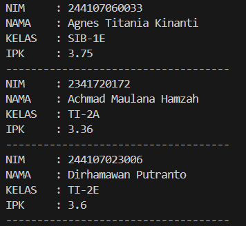

|  | Algorithm and Data Structure |
|--|--|
| NIM |  244107020210|
| Nama |  Khoirul Umam Novalidi |
| Kelas | TI - 1H |
| Repository | [link] (https://github.com/novalrnv/PRAKALSD.git) |
  

# Jobsheet 3 - Array Of Object
  

## 3.1 Percobaan 1 - Membuat Array dari Object, Mengisi dan Menampilkan

### 3.1.1 Langkah-langkah Percobaan

Menginputkan Kode Program sesuai perintah pada file [Mahasiswa12.java](./sc_code/Mahasiswa12.java) dan [MahasiswaDemo12.java](./sc_code/MahasiswaDemo12.java).

### 3.1.2 Verifikasi Hasil Running

### 3.1.3 Pertanyaan : 

1. 