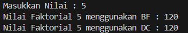
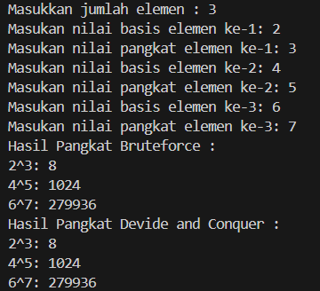
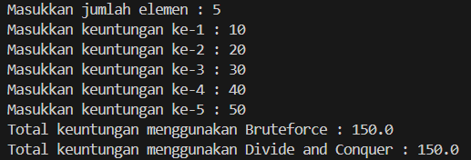

|  | Algorithm and Data Structure |
|--|--|
| NIM |  244107020210|
| Nama |  Khoirul Umam Novalidi |
| Kelas | TI - 1H |
| Repository | [link](https://github.com/novalrnv/PRAKALSD.git) |
  

# Jobsheet 5 - Brute Force dan Divide Conquer
  

## 3.1 Percobaan 1 - Menghitung Nilai Faktorial


### 3.1.1 Langkah-langkah Percobaan

Menginputkan kode program sesuai perintah dengan nama class [Faktorial](sc_code/faktorial.java) dan [FaktorialMain](sc_code/faktorialmain.java).

### 3.1.2 Verifikasi Hasil



### 3.1.3 Pertanyaan

1. Pada base line tersebut pengunnaan if dan else memiliki fungsi yang berbeda, if adalah base case dari faktorial tersebut, sehingga jika nilai 0 atau 1 outputnya adalah 1, sedangkan else disini adalah recursive case yang membagi masalah jadi lebih kecil.

2. Iya, memungkinkan untuk menggunakan perulangan lainnya seperti contohnya while loop dibawah
```java
public int faktorialBF(int n) {
    int fakto = 1;
    int i = 1;
    while (i <= n) {
        fakto *= i;
        i++;
    }
    return fakto;
}
```
3. Perbedaan dari 2 syntax tersebut adalah **fakto *= i;** adalah metode pendekatan iteratif, metode tersebut lebih efisien karena ketika menggunakan syntax tersebut akan langsung mengalikan nilai fakto dengan i, untuk **fakto = n * faktorialDC(n-1);** adalah metode pendekatan rekursif, metode ini kurang efisien karena menggunakan pemanggilan berulang untuk mencapai base case lalu mengalikan hasilnya.

4. Cara kerja method **faktorialBF()** adalah, method tersebut tidak menggunakan pemanggilan fungsi berulang yang dapat mengurangi penggunaan memori, sedangkan cara kerja method **faktorialDC()** ialah metode rekursi yang memecah masalah menjadi lebih kecil sehingga lebih banyak penggunaan memori karena memanggil fungsi secara berulang.


## 3.2 Percobaan 2 - Menghitung Hasil Pangkat


### 3.2.1 Langkah-langkah Percobaan

Menginputkan kode program sesuai perintah dengan nama class [Pangkat](/sc_code/pangkat.java) dan [PangkatMain](/sc_code/pangkatmain.java).

### 3.2.2 Verifikasi Hasil



### 3.2.3 Pertanyaan

1. Method **pangkatBF()** menggunakan loop untuk mengalikan sebanyak `n` yang diinputkan, sedangkan pada method **pangkatDC** menggunakan rekursi yang membagi proses pangkat menjadi dua bagian, kemudian mengalikan hasilnya.

2. Ya, tahap combine sudah termasuk. berikut bagian combine : 
```java
if(n%2==1){
                return (pangkatDC(a, n/2)*pangkatDC(a, n/2)*a);
            }else{
                return (pangkatDC(a, n/2)*pangkatDC(a, n/2));
            }
```

3. - Kurang relevan, karena atribut nilai dan pangkat sudah tersedia sebagai properti dari objek, tidak perlu lagi parameter.
    - Bisa, kita hanya perlu mengakses atribut dair objek itu sendiri. contohnya seperti kode berikut :
    ```java
    int pangkatBF(){
    int hasil = 1;
    for(int i = 0; i < this.pangkat; i++){
        hasil *= this.nilai;
    }
    return hasil;
    }```

4. Cara kerja **pangkatBF()** :
    - Melakukan perkalian berulang sebanyak nilai n.
    - Proses Linear.
    - Cocok untuk nilai n kecil, dan tidak efisien untuk n besar.

    Cara kerja **pangkatDC()** : 
    - Menggunakan metode Devide and Conquer : Jika `n == 1`, return `a.` dan Jika `n` ganjil dibagi dua, mengkalikan hasilnya dua kali, lalu dikalikan lagi dengan `a`.
    - Lebih efisian dari *BruteForce* untuk `n` besar, karena operasinya lebbih sedikit.


## 3.3 Percobaan 3 - Menghitung Sum Array


### 3.3.1 Langkah-langkah percobaan

Menginputkan kode program sesuai perintah dengan nama class [Sum](/sc_code/sum.java) dan [Summain](/sc_code/summain.java).

### 3.3.2 Verifikasi Hasil



### 3.3.3 Pertanyaan

1. Karena `mid` digunakan untuk membagi array menjadi 2 bagian : kiri dan kanan. ini membantu kita untuk menghitung total keuntungan dari masing-masing bagian secara terpisah.

2. Statement tersebut menghitung total keuntungan dari bagian kiri (`lsum`) dan kana (`rsum`) array secara rekursif.

3. Karena saya ingin mengetahui total keseluruhan. setelah menghitung kanan dan kiri, hasil tersebut akan digabungkan untuk mengetahui keseluruhan dengan cara menjumlahkan `lsum + rsum`.

4. Base casenya hanya ada satu elemen (ketika `l == r`). Di kondisi ini method tidak akan membagi array lebih lanjut dan mengembalikan nilai elemen tersebut.

5. `totalDC()` bekerja dengan membagi array  jadi dua terus-menerus (divide), menghitung total di masing-masing (conquer), lalu menjumlahkannya (combine).


## 3.4 Latihan

### Kode Program

### Alur Program