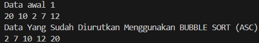
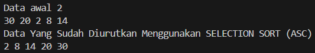
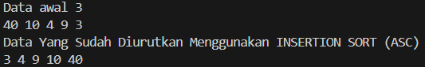
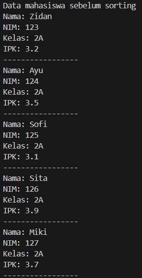
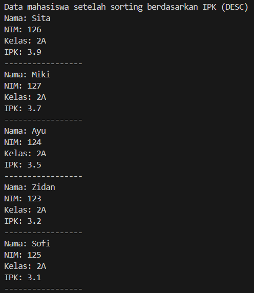
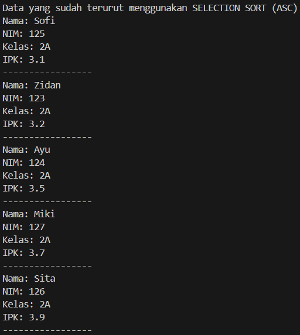
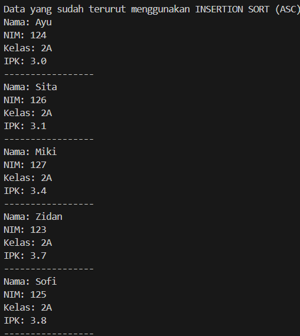

|  | Algorithm and Data Structure |
|--|--|
| NIM |  244107020210 |
| Nama |  KHOIRUL UMAM NOVALIDI |
| Kelas | TI - 1H |
| Repository | [link](https://github.com/novalrnv/PRAKALSD.git) |

# SORTING (BUBBLE, SELECTION, DAN INSERTION SORT)

## 6.1 Mengimplementasikan Sorting menggunakan object

**Penjelansan :**
1. Membuat class [Sorting12](sc_code/Sorting12.java) dan [SortingMain](sc_code/SortingMain12.java)

2. Menambahkan Method `Bubble Sort`, `Selection Sort`, dan `Insertion Sort`

**Verifikasi Running**

  

**Pertanyaan :**

1. **Jelaskan fungsi kode program berikut :**
```java
if (data[j - 1] > data[j]) {
              temp = data[j];
              data[j] = data[j - 1];
              data[j - 1] = temp;
            }
```
- Kode program tersebut berfungsi untuk mengurutkan elemen dalam sebuah array.

2.  **Tunjukkan kode program yang merupakan algoritma pencarian nilai minimum pada 
selection sort!**

```java
for (int j = i + 1; j < jumData; j++) {
            if (data[j] < data[min]) {
              min = j;
            }
          }
```

3. **Pada Insertion sort , jelaskan maksud dari kondisi pada perulangan**
`while (j >= 0 && data[j] > temp)` :

    - Penjelasan kondisi tersebut : selama elemen sebelumnya (`data[j]`) lebih besar dari elemen yang sedang disisipkan (`temp`), maka perulangan akan terus menggeser elemen ke kanan.

4. **Pada Insertion sort, apakah tujuan dari perintah** `data[j + 1] = data[j];`

    - Perintah ini menempatkan nilai `temp` (elemen yang sedang di-insert) ke posisi yang tepat setelah pergeseran selesai dilakukan.


## 6.2 Sorting Menggunakan Array of Object

**Penjelasan :**

Membuat 3 class sesuai Perintah [Mahassiswa12](sc_code/Mahasiswa12.java), [MahasiswaBerprestasi12](sc_code/MahasiswaBerprestasi12.java) dan [MahasiswaDemo12](sc_code/MahasiswaDemo12.java)

**Verifikasi Running**

 

**Pertanyaan :**

1. **Perhatikan perulangan di dalam bubbleSort() di bawah ini:** 
```java
for (int i = 0; i < listMhs.length - 1; i++) {
          for (int j = 1; j < listMhs.length - i; j++) {
```

a. Karena dalam Bubble Sort, setelah melakukan `n-1` (jika `n` adalah panjang array), semua elemen sudah berada di posisi yang benar.

b. Karena setiap `i` berjalan, elemen terbesar di sisa array akan **mengambang** ke posisi akhir. Jadi, selanjutnya kita tidak perlu membandingkan elemen yang sudah benar.

c. Jika data listMhs ada 50, Maka perulangan `i` akan berulang 49 kali (`50-1`), Dan tahap **Bubble Sort** yang ditempuh 49 kali juga.

2. **Modifikasi program diatas dimana data mahasiswa bersifat dinamis (input dari keyborad) 
yang terdiri dari nim, nama, kelas, dan ipk!**

```java
import java.util.Scanner;

public class MahasiswaDemo12 {
    public static void main(String[] args) {
        Scanner sc = new Scanner(System.in);
        MahasiswaBerprestasi12 list = new MahasiswaBerprestasi12();

        System.out.print("Masukkan NIM : ");
        String nim = sc.next();
        System.out.print("Masukkan Nama : ");
        String nama = sc.next();
        System.out.print("Masukkan Kelas : ");
        String kelas = sc.next();
        System.out.print("Masukkan IPK : ");
        double ipk = sc.nextDouble();
        Mahasiswa12 m = new Mahasiswa12(nim, nama, kelas, ipk);
        list.tambah(m);
```


## 6.3 Mengurutkan Data Mahasiswa Berdasarkan IPK(Selection Sort)

**Penjelasan :**

Menambahkan method **Selection Sort** pada class *MahasiswaBeprestasi12*.

**Verifikasi Running**




**Pertanyaan :**

Baris program tersebut untuk :

- `int idxMin = i;`→ Sebagai posisi IPK terkecil sementara.
- `for`→ Mengecek semua elemen setelah `i` (`j = i+1 hingga listMhs.length`).
- `if`→ Jika mahasiswa dengan IPK terkecil telah ditemukan maka variable `idxMin` diperbarui.

Proses tersebut digunakan untuk mencari indeks elemen dengan nilai IPK terkecil.


## 6.4 Mengurutkan Data Mahasiswa Berdasarkan IPK Menggunakan Insertion Sort

**Penjelasan :**

Menambahkan method **Insertion Sort** pada class *MahasiswaBerprestasi12*.

**Verifikasi Running**



**Pertanyaan :**

Mengubah fungsi InsertionSort menjadi secara Descending.
```java
public void insertionSort() {
        for (int i = 1; i < listMhs.length; i++) {
          Mahasiswa12 temp = listMhs[i];
          int j = i;
          while (j > 0 && listMhs[j - 1].ipk < temp.ipk) {
            listMhs[j] = listMhs[j - 1];
            j--;
          }
          listMhs[j] = temp;
        }
    }
``` 
Mengannti simbol `>` pada baris `while (j > 0 && listMhs[j - 1].ipk < temp.ipk) {` menjadi `<`.


## 6.5 Latian Praktikum

**Berikut adalah hasil running dari kode program yang saya buat sesuai perintah Diagram Class :**

