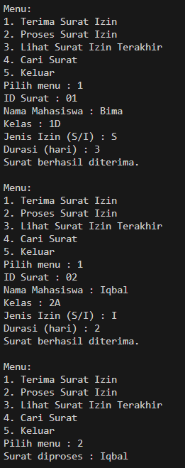

|  | Algorithm and Data Structure |
|--|--|
| NIM |  244107020210 |
| Nama |  KHOIRUL UMAM NOVALIDI |
| Kelas | TI - 1H |
| Repository | [link](https://github.com/novalrnv/PRAKALSD.git) |

# STACK

## 8.1 Mahasiswa Mengumpulakan Tugas

### Percobaan 1 ###
**Penjelasan**

- Membuat 3 class sesuai perintah [Mahasiswa12.java](sc_code/Mahasiswa12.java), [StackTugasMahasiswa12.java](sc_code/StackTugasMahasiswa12.java), dan [MahasiswaDemo12.java](sc_code/MahasiswaDemo12.java). Juga menginputkan method-method sesuai perintah.

**Verifikasi Hasil Running**


**Pertanyaan :**

1. Bagian yang perlu diperbaiki yaitu pada method `print()` pada kode baris berikut :
```java
for (int i = top; i >= 0; i--) {
```

2. Banyak data yang ditampung tergantung inputan pada saat mengedintifikasi parameter di class `main`, berikut kode programnya :
```java
StackTugasMahasiswa12 stack = new StackTugasMahasiswa12(..);
```

3. Pengecekan kondisi `!isFull()` pada method `push` diperlukan untuk menghindari terjadinya `ArrayIndexOutOfBoundsException` dan penambahan data ketika stack sudah penuh. Jika kondisi tersebut dihapus akan terjadi error karena data baru tidak dapat dimasukkan.

4. Menambahkan method baru pada class `StackTugasMahasiswa` dan menu baru pada class `MahasiswaDemo` seperti berikut : 
```java
public Mahasiswa12 bottom() {
        if (!isEmpty()) {
            return stack[0];
        } else {
            return null;
        }
    }
```
```java
case 4:
Mahasiswa12 bawah = stack.bottom();
                    if (bawah != null) {
                        System.out.println("Tugas terbawah dikumpulkan oleh: " + bawah.nama);
                    } else {
                        System.out.println("Stack kosong.");
                    }
                    break;
```

5. - Menambahkan method seperti berikut :
```java
public int count() {
    return top + 1;
}
```
 - Serta operasi menunya seperti berikut : 
```java
case 6:
    System.out.println("Jumlah tugas saat ini: " + stack.count());
    break;
```


### Percobaan 2 ###
**Penjelasan**

- Menambahkan method pada class `StackTugasMahasiswa12.java` dan membuat class baru [StackKonversi12.java](sc_code/StackKonversi12.java).

**Verifikasi Hasil Running**


**Pertanyaan :**

1. Penjelasan alur method `konversiDesimalKeBiner` :
- inisialisasi object `StackKonversi` untuk menyimpan hasil dari pembagian nilai desimal dengan 2.
- Perulangan dengan pembagian 2, selama `nilai > 0`.
- Setelah selesai, mengambil semua elemen dari stack menggunakan method `pop`.

2. Jika kode diubah menjadi `while (nilai != 0)` Hasilnya tidak berubah, karena tujuan dari kode tersebut berhenti setelah nilai menjadi 0, Akan tetapi kode `while (nilai > 0)` lebih efektif, karena hanya nilai positif yang diproses.


### TUGAS ###
**Penjelasan**

- Membuat 3 class yaitu : [Surat12.java](sc_code/Surat12.java), [StackSurat12.java](sc_code/StackSurat12.java), dan [SuratMain12.java](sc_code/SuratMain12.java).

- Penjelasan alur singkat :
    
    1. User memilih menu pada class main.
    2. Jika menu *1* yang dipilih maka akan diminta untuk menginputkan data surat.
    3. Jika menu *2* maka stack memanggil method `pop()` untuk memproses surat.
    4. Jika menu *3* maka program memanggil method `peek()` untuk menampilkan surat teratas / yang terakhir diinputkan.
    5. JIka menu *4* maka pengguna akan diminta untuk menginputkan nama mahasiswa untuk mencari apakah ada surat atas nama tersebut.
    6. Jika menu *5* maka akan keluar dari program.

**Verifikasi Hasil Running**




## Terimakasih :) ##