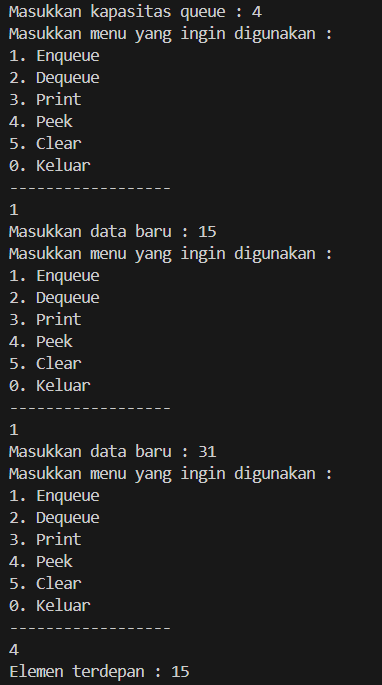
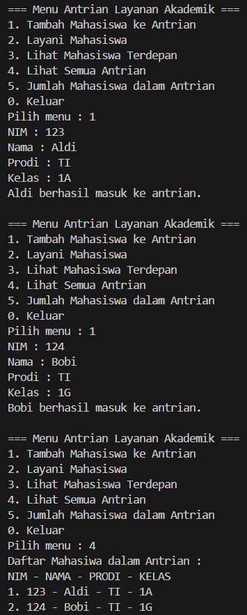
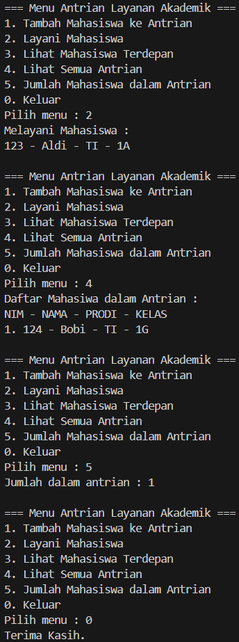

|  | Algorithm and Data Structure |
|--|--|
| NIM |  244107020210 |
| Nama |  KHOIRUL UMAM NOVALIDI |
| Kelas | TI - 1H |
| Repository | [link](https://github.com/novalrnv/PRAKALSD.git) |

# STACK

## 8.1 Mahasiswa Mengumpulakan Tugas

### Percobaan 1 ###
**Penjelasan**

- Membuat 2 class sesuai perintah [Queue.java](sc_code/Queue.java) dan [QueueMain.java](sc_code/QueueMain.java). Juga menginputkan method-method sesuai perintah.

**Verifikasi Hasil Running**

**Pertanyaan :**

1. 

### Percobaan 2 ###
**Penjelasan**

- Membuat 3 class sesuai perintah [Mahasiswa12.java](sc_code/Mahasiwa12.java), [AntrianLayanan12.java](sc_code/AntrianLayanan12.java) dan [LayananAkademikSIAKAD.java](sc_code/LayananAkademikSIAKAD.java). Juga menginputkan method-method sesuai perintah.

**Verifikasi Hasil Running**

**Pertanyaan :**
